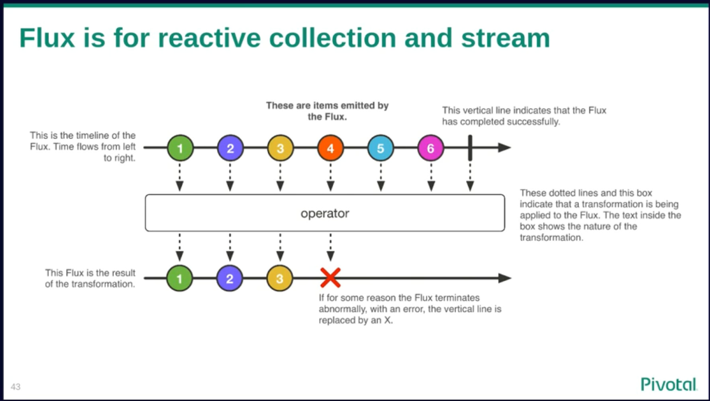

# Background

- multithreading
  - horizontal: each request goes on its own thread
  - data-channels: ->O->O->O->O
  - channels are more efficient
        

- reactive programming
  - goal is low latencies by efficient way of propagating changes over recalculate, rerender, resend everything
  - `a = b + c` (instead of keep recalculate a when wee need a current value, propagate the change of b or c)
  - suggested patterns: Observer, Immutable, EventLoop
    - everything is a stream of events being dispatched to event queues
    
        
    
- how spring helps?

  - instead of a simple sequence of commands, you'll create a topic, subscribe to that topic, and publish a flow of data to that topic
  - spring 5 ships reactor having Mono and Flux to help

# Reactor

  - build data-channels based on the logic of the request flow (Builder Pattern)
  - help to keep subscribe/publish to topics and hides this behind a functional api
  - Mono builds channels for 1-shot events
  - Flux builds channels for streams (which can have 0..N events travelling at once)
  - on a channel a Signal is travelling (data, or exception, or internal signal)
  - you can define handlers for various signals (onFinish, onError, .....)

  - those builders have 2 types of functionality:
    - before the event is fired (eg: transform)
      - your method return the same Mono/Flux object which you've received (imagine your function fits into a pipeline) (Mono -> Mono)
    - after the event is fired (eg: map, flatMap, flatMapMany...)
      - the data is fired, and unwrapped from the Mono/Flux and you operate on the data not on the channel itself (Pojo -> Pojo)

## Context
  - 1 instance of Mono/Flux holds a Context (key/value)
  - this is invented to have something similar to threadlocals
  - threadlocal-based solutions are problematic (eg: MDC)

## Schedulers:
  - single thread (prefer this for mutual exclusion over a blocing a mutex)
  - parallel (fixed sized pool)
  - elastic (eagerly growing pool with TTLs)

## Use threadpools:
  - subscribeOn (onSubscribe will run on the given threadpool)
  - publishOn (run onNext, onComplete, onError on the given scheduler)
  - publishNext (you split the stream to a given scheduler)
  - runOn (the data stream of a Flux can be spitted to rails)
    * a rail is a eventloop mapped to a thread and a poll-worker

## Tests:
  - use StepVerifier
  - make sure you verify completion signals
    

## Be careful:
    - in tests you stub thenReturn(Mono.error) not thenThrow
    - callstacks are independent from the business flow
    - very easy to do a blocking operation on a non-blocking thread (eg: you log into a file acquiring file-lock) or sending a metrics (acquiring lock on metricsregistry)
    - it has a custom memory tech: any data-channel needs to hit onComplete signal in order to be properly garbage collected

# Blocking vs Non-Blocking

    Non-Blocking mean your thread never wait for locking mutex, or network, or file-lock or so.
    Instead of blocking the threads, we better fill event queues (less memory impact).

1. use Logback's AsyncAppender for logging
1. use SingleThreadScheduler instead of locking mutexes
1. instead of recomputing something, prefer to send events to propagate the change
1. avoid threadlocals based frameworks (eg MDC)

### Advantages of reactive programming

1. responsive website
1. streaming data process (can be bigger than your heap, big data)
1. real-time simulations of complex systems (eg neural networks)

### Disadvantages of reactive programming

1. simple every-day tasks became complicated
2. 1 blocking operation in a row of 20 micros makes all of them slow
3. It's getting stable (~2% PrematureCloseException, NativeIOException)

